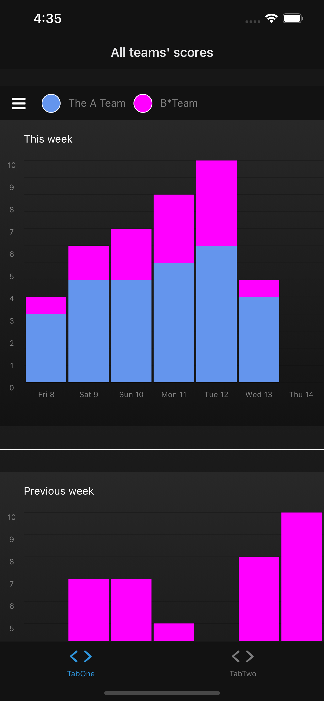
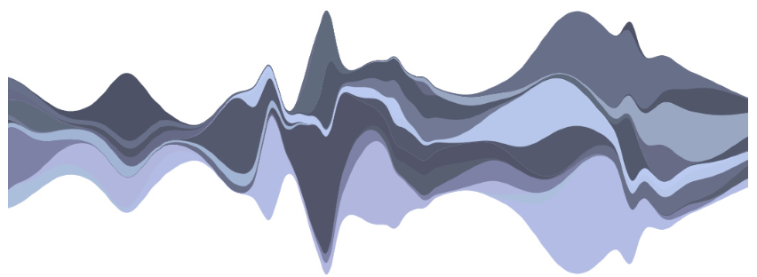

# D3 Graphs are fun!

## Setup

`yarn && yarn start`

## Considerations

My first experiment was with a discrete stacked bar graph with baseline `g₀ = 0`. The baseline for the second data set, `g₁`, is therefore a simple linear sum of `g₀ + A team score`. This means that the baseline is variable for all data except the A Team set.

Stacked graphs look nice, but are generally not the way to display this, or any kind of data. But, I thought, _what if you are for example measuring the performance of a Manager, Timmy, based not on the performance of his A team alone (which is filled with star players whose talents far exceed anyone's capacity to enrich them) but rather on the combined performance of Timmy's A and B teams?_

This seemed like a (pretty) way to display them weighted equally.

Even then, though, that data would likely be easier to see the shape of if the bars were the bars side-by-side.

And, if it's the overall shape we want, with no distinction between teams, then just combined the scores into one, and display that.

What if we're not interested in the overall shape alone, but we also want to record more complex data alongside? Data with different statistical properties, data that have differing onsets? Then it becomes interesting.

Imagine Team A and Team B were mapped alongside physiological data such as the onset and offset of various attempts performance-enhancing interventions. If these interventions are binary, and non-over-lapping, you can contrast the "with" and "without" conditions. But if there is gradual build up of e.g. blood oxygenation levels, glucose or pharmacological plasma concentrations, some of which could have heavy tails that overlap and therefore interact both with each other, and with perhaps the underlying scores?

I it might be nice to plot those as a time series, and by stacking the data not on the conventional x-axis, but symmetrically around the centre.

Then we'd derive a symmetric distance from the x-axis using: `g₀ + gₙ = 0`.

Thus we could calculate the baseline as `g₀ = -½∑f(x)` from `x = 1` to `x = n`. This function applies to differentiable intervals of the data, so best to interpolate into a continuous time-series.

The aim then is something more like:

And at that point we should probably install [R](https://cran.r-project.org/web/packages/TSstudio/vignettes/Plotting_Time_Series.html) and [Plotly](https://plotly.com/).

## References:

[1. Stacked Graphs – Geometry & Aesthetics](http://leebyron.com/streamgraph/stackedgraphs_byron_wattenberg.pdf)
